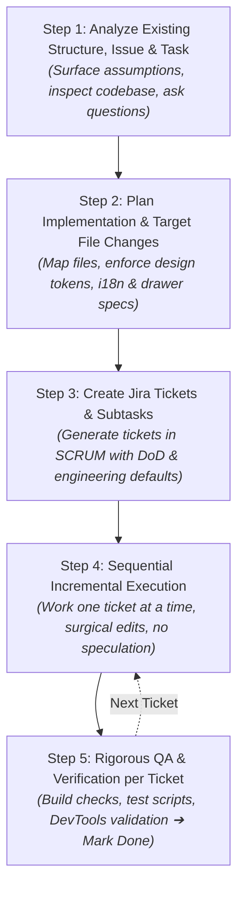

# AGENTS.md


<skills_system priority="1">

## Available Skills

<!-- SKILLS_TABLE_START -->
<usage>
When users ask you to perform tasks, check if any of the available skills
below can help complete the task more effectively.

How to use skills:
- Invoke: Bash("skilz read <skill-name> --agent universal")
- The skill content will load with detailed instructions
- Base directory provided in output for resolving bundled resources

Step-by-step process:
1. Identify a skill from <available_skills> that matches the user's request
2. Run the command above to load the skill's SKILL.md content
3. Follow the instructions in the loaded skill content
4. Skills may include bundled scripts, templates, and references

Usage notes:
- Only use skills listed in <available_skills> below
- Do not invoke a skill that is already loaded in your context
</usage>

<available_skills>

<skill>
<name>jira</name>
<description>Manages JIRA issues, projects, and workflows using Atlassian MCP. Use when asked to "create JIRA ticket", "search JIRA", "update JIRA issue", "transition issue", "sprint planning", or "epic management".</description>
<location>.agent/skills/jira/SKILL.md</location>
</skill>

<skill>
<name>karpathy-guidelines</name>
<description>Behavioral guidelines to reduce common LLM coding mistakes. Use when writing, reviewing, or refactoring code to avoid overcomplication, make surgical changes, surface assumptions, and define verifiable success criteria.</description>
<location>.agent/skills/karpathy-guidelines/SKILL.md</location>
</skill>

<skill>
<name>ops-operations-guide</name>
<description>Expert workflow and coding standards for the OPS SaaS Super Admin platform (Express, Prisma, PostgreSQL, MongoDB, React).</description>
<location>.agent/skills/ops-operations-guide/SKILL.md</location>
</skill>

<skill>
<name>minimalist-ui</name>
<description>Clean editorial-style interfaces. Warm monochrome palette, typographic contrast, flat bento grids, muted pastels. No gradients, no heavy shadows.</description>
<location>.agent/skills/minimalist-skill/SKILL.md</location>
</skill>

<skill>
<name>redesign-existing-projects</name>
<description>Upgrades existing websites and apps to premium quality. Audits current design, identifies generic AI patterns, and applies high-end design standards without breaking functionality. Works with any CSS framework or vanilla CSS.</description>
<location>.agent/skills/redesign-skill/SKILL.md</location>
</skill>

</available_skills>
<!-- SKILLS_TABLE_END -->

</skills_system>

---

# 🤖 AI Agent Standard Operating Method (5-Step Execution Protocol)

> [!IMPORTANT]
> **MANDATORY DIRECTIVE FOR ALL AI AGENTS**:
> Whenever given any task, feature request, bug fix, refactor, or architectural change by the user, you **MUST strictly and unconditionally execute the following 5-step lifecycle in sequence**.
> Do NOT skip steps, do NOT start coding before planning and Jira ticket creation, and do NOT close any ticket without completing its QA gate.

---

## 🧭 Project Skills & Standards Matrix

Before starting, activate and consult all applicable project skills located in `.agent/skills/`:

| Skill Name | Location | When to Use & Responsibility |
|---|---|---|
| **`karpathy-guidelines`** | `.agent/skills/karpathy-guidelines/SKILL.md` | Core mindset: Think before coding, simplicity first, surgical changes, goal-driven execution. |
| **`ops-operations-guide`** | `.agent/skills/ops-operations-guide/SKILL.md` | OPS platform architecture: Multi-tenancy isolation (`x-company-id`), Prisma cascade integrity, MongoDB audit streaming. |
| **`jira`** | `.agent/skills/jira/SKILL.md` | Atlassian MCP orchestration: Creating tickets/subtasks under `SCRUM`, injecting mandatory engineering defaults, updating states (`In Progress` ➔ `Done`). |
| **`minimalist-ui`** | `.agent/skills/minimalist-skill/SKILL.md` | Visual design standard: Clean editorial aesthetic, warm monochrome (`#F7F6F3` / `#111111`), typographic hierarchy, `1px solid #EAEAEA` crisp borders, muted pastels, zero heavy shadows, zero emojis. |
| **`redesign-existing-projects`** | `.agent/skills/redesign-skill/SKILL.md` | Refactoring legacy/generic UI: Upgrading interfaces to premium quality without breaking domain functionality. |
| **Chrome DevTools MCP** | Tool group `chrome-devtools-mcp` | Interactive runtime testing: Inspect DOM, verify responsive drawers, validate 0 console errors/warnings. |

---

## 📋 The 5-Step Agent Execution Method



---

### Step 1: Deep Analysis, Structure Inspection & Clarification
1. **Analyze Codebase Structure & Dependencies**:
   - Inspect relevant directory trees, database models (`schema.prisma`, Mongoose schemas), API routes, components, and state management.
   - Trace existing patterns to ensure full architectural harmony.
2. **Deconstruct the User Task**:
   - Identify affected modules across the system (e.g. `OPS Backend`, `OPS Frontend`, `ETMS-FE`, `ETMS Backend`).
   - Identify cross-cutting concerns: RBAC permissions, audit logging, multi-tenant scoping, localization, and theme styling.
3. **Surface Tradeoffs & Ask Clarifying Questions** (*Karpathy Rule #1*):
   - Never assume user intent when requirements are ambiguous.
   - If multiple valid implementations exist, explicitly present the options and tradeoffs to the user.
   - If an existing constraint or edge case conflicts with the prompt, surface it and ask questions before proceeding to code.

---

### Step 2: Surgical Implementation Planning & File Mapping
1. **Define File-Level Impact**:
   - Explicitly enumerate every file to be touched using clear demarcations: `[NEW]`, `[MODIFY]`, `[DELETE]`.
   - Never touch files outside the direct scope of the task (*Karpathy Rule #3*).
2. **Enforce Core Project Standards**:
   - **Right Slide-Over Drawer Architecture**: Zero centered modal popups. All interactive dialogs, forms, and wizards must use standard `AppDrawer` / `Drawer` sliding from the right with sticky header, scrollable body, and sticky pinned footer.
   - **Dynamic i18n & Single-Language Rule**: Zero hardcoded static strings. Use `useI18n()`. Strict single active language (no mixed strings like `"Shift / શિફ્ટ"`). Expand all 8 regional languages (`en`, `gu`, `hi`, `mr`, `ta`, `te`, `kn`, `bn`).
   - **Minimalist Editorial UI**: Adhere to `minimalist-ui` standards: Warm bone background (`#F7F6F3`), off-black text (`#111111`), border `1px solid #EAEAEA`, muted pastels, crisp typography (`SF Pro Display`, `Geist Sans`, `Geist Mono`), zero emojis, zero heavy drop shadows.
   - **Multi-Tenant Isolation**: Enforce `x-company-id` header validation and scoped Prisma/Sequelize queries.
3. **Draft the Implementation Plan**:
   - Document the plan with verifiable acceptance criteria for each component.

---

### Step 3: Jira Ticket & Subtask Orchestration
1. **Project & Epic Mapping**:
   - Target the active Jira project (`SCRUM`).
   - Use `jira` skill / Atlassian MCP tools (`searchJiraIssuesUsingJql`, `createJiraIssue`, `createIssueLink`).
2. **Generate Structured Tickets & Subtasks**:
   - Create parent Story/Task for the feature and discrete Subtasks for each file/component layer.
   - Inject mandatory engineering defaults and acceptance criteria into the ticket description:
     ```markdown
     ### 📋 Objective & Scope
     [Concise description of the task]

     ### 🏗️ Mandatory Engineering Methods & Standards
     - [ ] **Drawer Architecture**: Right slide-over drawer (zero centered modals).
     - [ ] **Dynamic i18n**: Single-language active mode via `useI18n()`, 8 languages covered, 0 static strings.
     - [ ] **Multi-Tenancy**: `x-company-id` tenant isolation enforced.
     - [ ] **Minimalist UI**: Editorial styling, warm monochrome, no generic shadows or emojis.

     ### 📝 Implementation Sub-tasks & Target Files
     1. [MODIFY] `path/to/file1` - [Action]
     2. [NEW] `path/to/file2` - [Action]

     ### ✅ Definition of Done (DoD) & QA Criteria
     - [ ] Build passes with 0 errors (`npm run build`).
     - [ ] Unit/Integration QA tests pass with 100% success.
     - [ ] Live UI responsive verification via DevTools.
     ```
3. **Capture Keys**: Store the created ticket keys (e.g. `SCRUM-201`, `SCRUM-202`) for progress tracking and commit references.

---

### Step 4: Incremental & Surgical Execution (One Ticket at a Time)
1. **Single-Ticket Focus**:
   - Transition the active Jira issue to `In Progress` using Atlassian MCP (`transitionJiraIssue`).
   - Work strictly on one ticket/subtask at a time.
2. **Simplicity First (*Karpathy Rule #2*)**:
   - Implement the minimum code required to solve the ticket's acceptance criteria.
   - No speculative features, no unused abstractions, no unrequested configurability.
3. **Surgical Precision (*Karpathy Rule #3*)**:
   - Match existing codebase styling, variable naming, and architectural patterns.
   - Clean up only imports or variables made unused by your changes. Do not refactor unrelated adjacent code.

---

### Step 5: Rigorous QA & Verification per Ticket
1. **Automated Quality Gates**:
   - **Build Verification**: Run `npm run build` in the affected frontend directory (e.g. `d:\bhasker\OPS\frontend` or `d:\bhasker\ETMS-FE`). Must compile with **0 errors and 0 warnings**.
   - **Backend Verification**: Run `npm test` or the dedicated QA runner (`node run_master_qa_suite.js` or `node test_<feature>_qa.js`) in `backend/`. 100% pass rate required.
2. **Interactive & Visual QA**:
   - Verify that UI components conform to the `minimalist-ui` theme and responsive Right Slide-Over Drawer specs.
   - Verify dynamic localization toggles across languages with zero missing keys or layout breaks.
   - Use Chrome DevTools MCP where applicable to inspect the console for runtime exceptions or network failures.
3. **Ticket Closure & Sign-Off**:
   - Add a comment to the Jira ticket with verification logs and output (`addCommentToJiraIssue`).
   - Transition the ticket to `Done` (transition ID `41`).
   - Repeat Steps 4 and 5 sequentially until all tickets and subtasks are verified.

