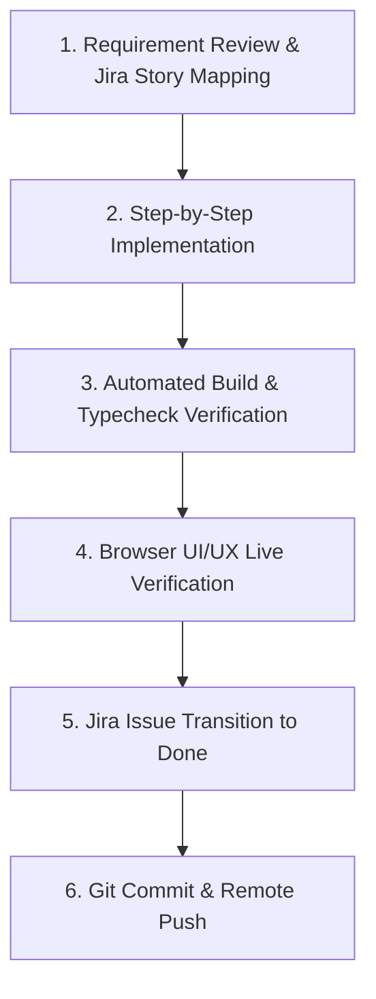

# 🛠️ Agent Engineering Guidelines & Project Methods Standard
**Surat Embroidery Micro-ERP (EBTM / ETMS / OPS Super Admin)**

---

## 1. System Architecture & Port Mapping

| Component | Codebase Path | Technology Stack | Active Dev Port | Primary Responsibility |
|---|---|---|---|---|
| **OPS Backend** | `d:\bhasker\OPS\backend` | Express / Node 20 / PostgreSQL (Prisma) / MongoDB | `5000` | Multi-Tenant SaaS Super-Admin, Company Provisioning & Audit Logs |
| **OPS Frontend** | `d:\bhasker\OPS\frontend` | Vite / React 19 / Modern CSS Tokens | `5173` (Docker: `3000`) | Super-Admin Portal & Tenant Operations Management |
| **ETMS Backend** | `d:\bhasker\ETMS\backend` | NestJS 10 / PostgreSQL (Sequelize) / Redis | `4000` | SAC 9988 Billing, Karigar Hisab, Party Ledger, Munim & Tally XML Engine |
| **ETMS Frontend** | `d:\bhasker\ETMS-FE` | Next.js 14.2 / Tailwind CSS / Lucide / Sonner | `3000` | Factory Floor Telemetry, Shift Drawer, Party Master, Thermal Printing & PWA |

---

## 2. Design System Standard: Right Slide-Over Drawer Architecture

> [!IMPORTANT]
> **Zero Centered Popups Policy**: All modal dialogs and centered popups across both OPS and ETMS are deprecated and replaced by standard **Right Slide-Over Drawers** (`Drawer` / `AppDrawer`).

### Drawer Anatomy & UX Rules:
1. **Slide-Over Panel**: Slides from the right with smooth cubic-bezier animation (`translate-x-full` to `translate-x-0`).
2. **Dimmed Backdrop**: `bg-slate-900/50 backdrop-blur-xs` preserving underlying table context.
3. **Sticky Top Header**: Clean title, descriptive subtitle, icon badge, and `X` dismiss button.
4. **Scrollable Body**: `flex-1 overflow-y-auto` with standardized custom scrollbar.
5. **Sticky Pinned Footer**: Action buttons (*Cancel*, *Save*, *Submit*) pinned at bottom of viewport—never pushed below screen fold.
6. **Accessibility**: `ESC` key dismiss listener and body scroll locking (`document.body.style.overflow = 'hidden'`).
7. **Nested Drawers**: Level-based z-indexes supporting multi-level creation (e.g. `ADD_PARTY` drawer opened on top of `ADD_CHALLAN`).

---

## 3. Dynamic i18n & Single-Language Architecture Standard (MANDATORY)

> [!IMPORTANT]
> **Zero Static Strings & Single Active Language Policy**:
> Whenever developing any **new feature, new module, new drawer, new modal, new page, new component, new toast alert, or new print slip**, the following standards are strictly enforced:

### Core Localization Rules:
1. **No Hardcoded Static Text**:
   - Never write raw text strings directly into JSX/TSX elements.
   - All titles, subtitles, input labels, placeholders, table headers, status chips, action buttons, tooltips, validation messages, and toast notifications **must** use the dynamic `useI18n()` hook (`const { t, translate, language } = useI18n()`).
2. **Single Language at a Time (Zero Bilingual Combinations)**:
   - **Never mix multiple languages in the same element** (e.g. ❌ `"Edit Karigar / Operator (કારીગર સુધારો)"`, ❌ `"Gross Wages (કુલ મજૂરી)"`, ❌ `"Shift / શિફ્ટ"`).
   - The UI must render strictly in **one single language** at any given moment corresponding to the active setting.
3. **Exclusively Controlled by Header Language Settings**:
   - The active language is governed globally by the **Header Language Switcher** (`src/components/molecules/LanguageSwitcher.tsx` in `Navbar.tsx`).
   - `I18nProvider` (`src/lib/i18n.tsx`) synchronizes state with `localStorage['etms_lang']` and `document.documentElement.lang`.
   - All drawers, pages, and components must react dynamically to header language changes without page refreshes.
4. **Mandatory Dictionary Expansion for All 8 Regional Languages**:
   - When introducing any new key, define it in `src/lib/translations/en.ts` and add translations to all 8 language modules:
     - English (`en.ts`)
     - Gujarati (`gu.ts`)
     - Hindi (`hi.ts`)
     - Marathi (`mr.ts`)
     - Tamil (`ta.ts`)
     - Telugu (`te.ts`)
     - Kannada (`kn.ts`)
     - Bengali (`bn.ts`)
5. **Key Naming Convention**:
   - Use structured namespacing: `<module>_<feature/section>_<element>` (e.g. `drawer_karigar_title`, `shift_wizard_step1Title`, `party_filter_active`).

### Code Standard Example:

#### ❌ Anti-Patterns (STRICTLY PROHIBITED):
```tsx
// ❌ PROHIBITED: Hardcoded English and mixed bilingual strings
<Drawer
  title="Add New Karigar / Operator (નવો કારીગર ઉમેરો)"
  subtitle="કારીગર મૂળભૂત માહિતી અને પગાર/મજૂરી દરો"
>
  <label>Mobile Number (મોબાઇલ નંબર)</label>
  <button>+ Log Shift</button>
</Drawer>
```

#### ✅ Correct Pattern (REQUIRED):
```tsx
// ✅ REQUIRED: Fully dynamic i18n resolved via header-controlled context
import { useI18n } from '@/lib/i18n';

export const KarigarDrawerForm = () => {
  const { t } = useI18n();

  return (
    <Drawer
      title={editingItem ? t.karigarDrawer_editTitle : t.karigarDrawer_addTitle}
      subtitle={editingItem ? t.karigarDrawer_editSubtitle : t.karigarDrawer_addSubtitle}
    >
      <label>{t.mobileNumber}</label>
      <button>{t.navShiftNew}</button>
    </Drawer>
  );
};
```

---

## 4. Core Business & Domain Workflows

### A. Karigar Master & Wage Incentive Engine
- **Per-Meter (`PER_METER`)**: Total meters produced × Rate/meter.
- **Per-Piece (`PER_PIECE`)**: Total sarees/garments finished × Rate/piece.
- **Fixed Monthly (`MONTHLY_FIXED`)**: Guaranteed monthly salary.
- **Hybrid Incentive (`FIXED_PLUS_INCENTIVE`)**: Guaranteed base salary + surplus production commission when exceeding shift/fortnight threshold (e.g. Base salary up to 100,000 stitches + ₹X per 1,000 extra stitches or ₹Y per piece).

### B. Inward Lot (Challan) & Multi-Design Master
- Each Inward Challan tracks multiple cloth lots, each assigned a specific **Design Number**, total stitches, jobwork billing rate, and Karigar piece-rate commission.
- Lots and designs are allocated to active machines during shift logging.

### C. Party (Trader) Master & Ledger Khata
- Searchable Party picker (`PartyPicker`) with autocomplete by Name, Surat GSTIN (`24`), and phone.
- Contextual in-flow `+ Add Party` drawer trigger across Challan and Invoice drafting.
- Party statement (`/parties/[id]`) with 3-tier aging, running balances, and WhatsApp share.

### D. Consolidated Multi-Lot Outward Invoicing
- Fetch all unbilled inward lots for a selected party.
- Consolidate multiple lots into a single SAC 9988 GST Tax Invoice with automated CGST/SGST/IGST breakdown.

---

## 4. Standardized Sprint & Git Delivery Protocol

All agent work follows a rigorous 6-step lifecycle:



1. **Jira Issue Tracking**: Every task must be mapped to a Jira ticket under project `SCRUM`.
2. **Code Implementation**: Clean, surgical changes adhering to modular domain architecture.
3. **Build Quality Gate**:
   - `npm run build` in `OPS/frontend` (Vite) ➔ Must pass with 0 errors.
   - `npm run build` in `ETMS-FE` (Next.js) ➔ Must pass all typechecks and generate all static/dynamic routes cleanly.
4. **Live Verification**: Automated browser inspection via Chrome DevTools MCP verifying interactive states and responsive drawers.
5. **Jira Closure**: Transition issue to `Done` (transition ID `41`) with detailed release notes.
6. **Git Release**: Once all sprint tickets are finalized, stage, commit, and push the verified codebase to Git remote.
